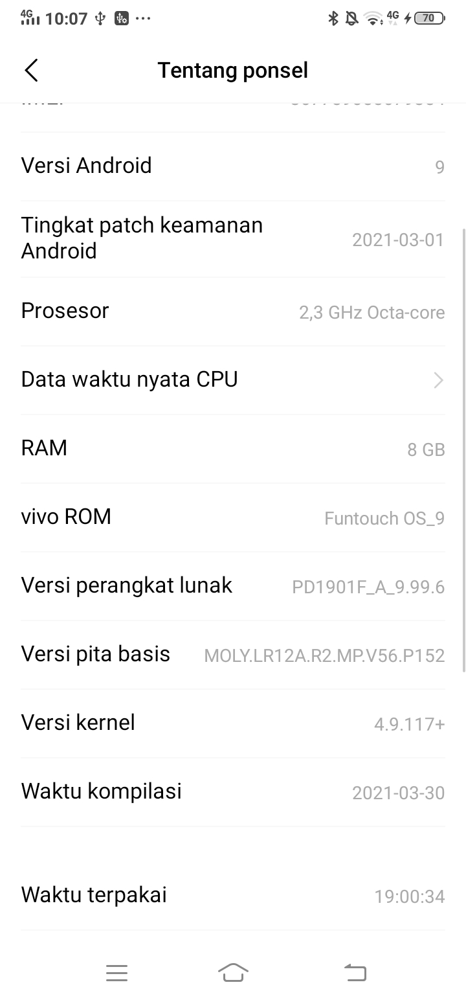
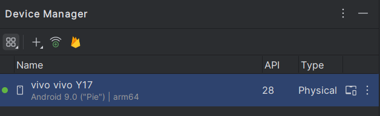
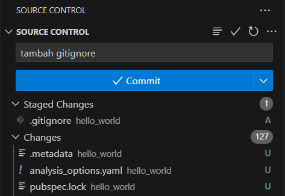
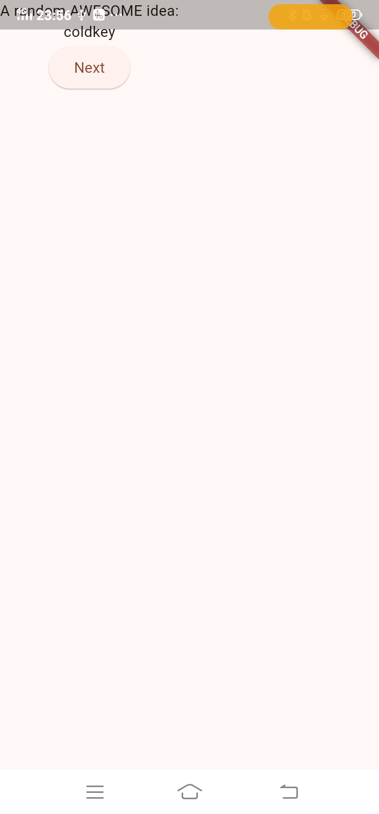

<table>
    <thead>
        <th style="text-align: center;" colspan="2">Pertemuan 5</th>
    </thead>
    <tbody>
        <tr>
            <td>Nama</td>
            <td>Rizky Fitri Andini</td>
        </tr>
        <tr>
            <td>Nim</td>
            <td>2241720170</td>
        </tr>
    </tbody>
</table>

# Aplikasi Pertama dan Widget Dasar Flutter
----
## Praktikum 1 : Membuat Project Flutter Baru
Buka VS Code, lalu tekan tombol Ctrl + Shift + P maka akan tampil Command Palette, lalu ketik Flutter. Pilih New Application Project.

Kemudian buat folder sesuai style laporan praktikum yang Anda pilih. Disarankan pada folder dokumen atau desktop atau alamat folder lain yang tidak terlalu dalam atau panjang. Lalu pilih Select a folder to create the project in.

Buat nama project flutter hello_world seperti berikut, lalu tekan Enter. Tunggu hingga proses pembuatan project baru selesai.

Jika sudah selesai proses pembuatan project baru, pastikan tampilan seperti berikut. Pesan akan tampil berupa "Your Flutter Project is ready!" artinya Anda telah berhasil membuat project Flutter baru.

## Praktikum 2: Menghubungkan Perangkat Android atau Emulator
Untuk menampilkan opsi developer dan mengaktifkan Proses debug USB:
Di perangkat Android, ketuk Settings > About phone. Ketuk Build number tujuh kali.

Kembali ke Settings, lalu ketuk System > Developer options.

Ketuk Developer options, lalu ketuk tombol USB debugging untuk mengaktifkannya.

Jika Android Studio diinstal di Windows, Anda harus menginstal driver perangkat USB agar dapat menjalankan aplikasi di perangkat fisik.

Di Android Studio, klik Tools > SDK Manager. Dialog Preferences > Appearance & Behavior > System Settings > Android SDK akan terbuka.
Klik tab SDK Tools.
Pilih Google USB Driver, lalu klik OK

Untuk menjalankan aplikasi dari Android Studio di perangkat Android:

Sambungkan perangkat Android ke komputer menggunakan kabel USB. Dialog yang meminta Anda mengizinkan proses debug USB akan muncul di perangkat.

Pilih kotak centang Always allow from this computer, lalu ketuk OK. Di Android Studio di komputer, pastikan perangkat Anda dipilih di menu drop-down. Klik Ini adalah ikon Run Android Studio.

## Praktikum 3: Membuat Repository GitHub dan Laporan Praktikum
Login ke akun GitHub Anda, lalu buat repository baru dengan nama "flutter-fundamental-part1"

Lalu klik tombol "Create repository" lalu akan tampil seperti gambar berikut.

Kembali ke VS code, project flutter hello_world, buka terminal pada menu Terminal > New Terminal. Lalu ketik perintah berikut untuk inisialisasi git pada project Anda.

Pilih menu Source Control di bagian kiri, lalu lakukan stages (+) pada file .gitignore untuk mengunggah file pertama ke repository GitHub.
Beri pesan commit "tambah gitignore" lalu klik Commit (✔)

Lakukan push dengan klik bagian menu titik tiga > Push

Di pojok kanan bawah akan tampil seperti gambar berikut. Klik "Add Remote"

Salin tautan repository Anda dari browser ke bagian ini, lalu klik Add remote

Setelah berhasil, tulis remote name dengan "origin"

Lakukan hal yang sama pada file README.md mulai dari Langkah 4. Setelah berhasil melakukan push, masukkan username GitHub Anda dan password berupa token yang telah dibuat (pengganti password konvensional ketika Anda login di browser GitHub).

Reload halaman repository GitHub Anda, maka akan tampil hasil push kedua file tersebut seperti gambar berikut.

Lakukan push juga untuk semua file lainnya dengan pilih Stage All Changes. Beri pesan commit "project hello_world". Maka akan tampil di repository GitHub Anda seperti berikut.

Kembali ke VS Code, ubah platform di pojok kanan bawah ke emulator atau device atau bisa juga menggunakan browser Chrome. Lalu coba running project hello_world dengan tekan F5 atau Run > Start Debugging. Tunggu proses kompilasi hingga selesai, maka aplikasi flutter pertama Anda akan tampil seperti berikut.

Silakan screenshot seperti pada Langkah 11, namun teks yang ditampilkan dalam aplikasi berupa nama lengkap Anda. Simpan file screenshot dengan nama 01.png pada folder images (buat folder baru jika belum ada) di project hello_world Anda. Lalu ubah isi README.md seperti berikut, sehingga tampil hasil screenshot pada file README.md. Kemudian push ke repository Anda.

## Praktikum 4: Menerapkan Widget Dasar
Buat folder baru basic_widgets di dalam folder lib. Kemudian buat file baru di dalam basic_widgets dengan nama text_widget.dart. Ketik atau salin kode program berikut ke project hello_world Anda pada file text_widget.dart.

Lakukan import file text_widget.dart ke main.dart, lalu ganti bagian text widget dengan kode di atas. Maka hasilnya seperti gambar berikut. Screenshot hasil milik Anda, lalu dibuat laporan pada file README.md.

Output:

Buat sebuah file image_widget.dart di dalam folder basic_widgets dengan isi kode berikut.

Lakukan penyesuaian asset pada file pubspec.yaml dan tambahkan file logo Anda di folder assets project hello_world.

Jangan lupa sesuaikan kode dan import di file main.dart kemudian akan tampil gambar seperti berikut.

Output:

## Praktikum 5: Menerapkan Widget Material Design dan iOS Cupertino
Buat file di basic_widgets > loading_cupertino.dart. Import stateless widget dari material dan cupertino. Lalu isi kode di dalam method Widget build adalah sebagai berikut.

Output:

Button widget terdapat beberapa macam pada flutter yaitu ButtonBar, DropdownButton, TextButton, FloatingActionButton, IconButton, OutlineButton, PopupMenuButton, dan ElevatedButton.
Buat file di basic_widgets > fab_widget.dart. Import stateless widget dari material. Lalu isi kode di dalam method Widget build adalah sebagai berikut.

Output:

Scaffold widget digunakan untuk mengatur tata letak sesuai dengan material design.
Ubah isi kode main.dart seperti berikut.

Output:

Dialog widget pada flutter memiliki dua jenis dialog yaitu AlertDialog dan SimpleDialog.
Ubah isi kode main.dart seperti berikut.

Output:

Flutter menyediakan widget yang dapat menerima input dari pengguna aplikasi yaitu antara lain Checkbox, Date and Time Pickers, Radio Button, Slider, Switch, TextField.
Contoh penggunaan TextField widget adalah sebagai berikut:

Output:

Date and Time Pickers termasuk pada kategori input dan selection widget, berikut adalah contoh penggunaan Date and Time Pickers.

Output:

## Tugas
Selesaikan Codelabs: Your first Flutter app, lalu buatlah laporan praktikumnya dan push ke repository GitHub Anda!

### 1. Membuat project
Pada panel sebelah kiri VS Code, pastikan bahwa Explorer dipilih lalu buka file pubspec.yaml. Ganti konten file ini dengan kode berikut:

Berikutnya, buka file konfigurasi lainnya dalam proyek tersebut, analysis_options.yaml. Ganti konten file tersebut dengan kode berikut:

Terakhir, buka file main.dart pada direktori lib/. Ganti konten file ini dengan kode berikut:

Output:

### 2. Menambahkan tombol
Di bagian bawah lib/main.dart, tambahkan sesuatu pada string di objek Text pertama, dan simpan file tersebut (dengan Ctrl+S atau Cmd+S). Misalnya:

Output:

Berikutnya, tambahkan tombol di bagian bawah Column, tepat di bawah instance Text kedua.

Output:

Scroll ke MyAppState lalu tambahkan metode getNext.

Metode getNext() baru menetapkan ulang current dengan WordPair acak baru. Metode ini juga memanggil notifyListeners()(metode ChangeNotifier) yang memastikan bahwa semua orang yang melihat MyAppState diberi tahu.

Tindakan terakhir adalah memanggil metode getNext dari callback tombol tersebut.

Output:

### 3. Memperindah tampilan aplikasi
Tulis ulang widget MyHomePage sebagai berikut:

Pada menu Refactor, pilih Extract Widget. Tetapkan nama, seperti BigCard, lalu klik Enter.

Tindakan ini secara otomatis membuat class baru, BigCard, di akhir file saat ini. Class tersebut akan terlihat seperti berikut:

Output:

Temukan class BigCard dan metode build() yang berada di dalamnya. Sama seperti sebelumnya, panggil menu Refactor pada widget Text. Namun, kali ini Anda tidak akan mengekstrak widget.
Sebagai gantinya, pilih Wrap with Padding. Tindakan ini menciptakan widget induk baru di sekitar widget Text bernama Padding. Setelah menyimpannya, Anda akan melihat bahwa kata acak tersebut telah memiliki ruang yang lebih luas.

Berikutnya, mari kita naik satu tingkat lebih tinggi. Tempatkan kursor Anda pada widget Padding, buka menu Refactor, lalu pilih Wrap with widget....
Tindakan ini memungkinkan Anda untuk menentukan widget induk. Ketik "Card" dan tekan Enter. Kode ini menggabungkan widget Padding, dan juga Text, dengan widget Card.

Output:

Buat perubahan berikut untuk metode build() BigCard.

Kini, Card telah diwarnai dengan warna primer aplikasi:

Card tersebut masih memiliki masalah: ukuran teks terlalu kecil dan warnanya membuat teks sulit dibaca. Untuk memperbaiki masalah ini, buat perubahan berikut pada metode build() BigCard.

Output:

Gunakan properti semanticsLabel Text untuk mengganti konten visual widget teks dengan konten semantik yang lebih sesuai untuk pembaca layar:

Saatnya menempatkan UI di tengah jendela/layar aplikasi. Pertama, ingatlah bahwa BigCard adalah bagian dari Column. Secara default, kolom menggabungkan turunan kolom di bagian atas, tetapi kita dapat mengganti ini dengan mudah. Buka metode build() MyHomePage, dan buat perubahan berikut:

Output:

Letakkan kursor Anda di Column, buka menu Refactor (dengan Ctrl+. atau Cmd+.), lalu pilih Wrap with Center.

Output:

Jika mau, Anda dapat menyesuaikan tampilan ini lebih lanjut.

- Anda dapat menghapus widget Text di atas BigCard. Dapat dipastikan bahwa teks deskriptif ("Ide LUAR BIASA acak:") tidak lagi diperlukan karena UI tersebut sudah jelas meskipun tanpa teks deskriptif. Selain itu, dengan begitu UI terlihat lebih bersih.
- Anda juga dapat menambahkan widget SizedBox(height: 10) di antara BigCard dan ElevatedButton. Dengan begitu, ada sedikit pemisah di antara kedua widget tersebut. Widget SizedBox hanya mengambil ruang dan tidak merender apa pun dengan sendirinya. Widget ini biasa digunakan untuk membuat "jarak" visual.

Dengan perubahan opsional, MyHomePage mencakup kode berikut:

Output:

### 4. Menambahkan fungsi
Scroll ke MyAppState dan tambahkan kode berikut:

Output:

Dengan terselesaikannya "logika bisnis", saatnya untuk mengerjakan antarmuka pengguna kembali. Meletakkan tombol ‘Like' di sebelah kiri tombol ‘Next' memerlukan Row. Widget Row adalah padanan horizontal dari Column, yang telah Anda lihat sebelumnya.
Pertama, gabungkan tombol yang ada pada Row. Buka metode build() MyHomePage, letakkan kursor pada ElevatedButton, buka menu Refactor dengan Ctrl+. atau Cmd+., lalu pilih Wrap with Row.

Output:

Buat perubahan berikut:

Output:

Berikut satu cara untuk menambahkan tombol kedua untuk MyHomePage. Kali ini, gunakan konstruktor ElevatedButton.icon() untuk membuat tombol dengan ikon. Di bagian atas metode build, pilih ikon yang sesuai tergantung pada apakah pasangan kata saat ini sudah berada di favorit atau tidak. Selain itu, perhatikan penggunaan SizedBox lagi, untuk menjaga jarak antara kedua tombol.

Output:

### 5. Menambahkan kolom samping navigasi
Untuk mencapai inti dari langkah ini secepat mungkin, pisahkan MyHomePage menjadi 2 widget terpisah.

Pilih keseluruhan MyHomePage, hapus, dan gantikan dengan kode berikut:

Output:

Masukkan StatefulWidget, jenis widget yang memiliki State. Pertama, konversi MyHomePage menjadi widget stateful.

Tempatkan kursor Anda di baris pertama MyHomePage (baris yang diawali dengan class MyHomePage...), lalu buka menu Refactor menggunakan Ctrl+. atau Cmd+.. Kemudian, pilih Convert to StatefulWidget.

Widget stateful baru hanya perlu melacak satu variabel: selectedIndex. Buat 3 perubahan berikut untuk _MyHomePageState:

Output:

Tempatkan kode berikut di bagian atas metode build _MyHomePageState, tepat sebelum return Scaffold:

Kini, setelah page berisi widget yang ingin Anda tampilkan di sebelah kanan, Anda mungkin dapat menebak perubahan apa lagi yang diperlukan.
Berikut tampilan _MyHomePageState setelah satu perubahan tersebut:

Output:

Sekali lagi, gunakan menu Refactor Flutter di VS Code untuk membuat perubahan yang diperlukan. Namun, proses kali ini sedikit lebih rumit:
- Dalam metode build _MyHomePageState, letakkan kursor Anda pada Scaffold.
- Buka menu Refactor dengan Ctrl+. (Windows/Linux) atau Cmd+. (Mac).
- Pilih Wrap with Builder dan tekan Enter.
- Modifikasi nama Builder yang baru ditambahkan menjadi LayoutBuilder.
- Modifikasi daftar parameter callback dari (context) menjadi (context, constraints).

Sekarang kode Anda dapat memutuskan untuk menampilkan label dengan membuat kueri constraints saat ini atau tidak. Buat perubahan baris tunggal berikut untuk metode build _MyHomePageState:

Output:

### 6. Menambahkan halaman baru
Berikut ini hanyalah salah satu cara untuk menerapkan halaman favorit. Bagaimana halaman ini diterapkan (semoga) akan menginspirasi Anda untuk bermain dengan kode—meningkatkan UI dan membuat UI sesuai keinginan Anda.

Berikut class FavoritesPage baru:

Output:

